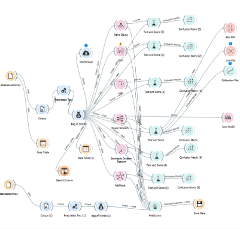

# Klasifikasi Sentimen


## Deskripsi Proyek

Proyek ini bertujuan untuk melakukan analisis sentimen terhadap komentar pengguna di platform e-commerce seperti Lazada, Shopee, dan Tokopedia. Data yang digunakan terdiri dari 400 komentar, yang diklasifikasikan berdasarkan rating produk:

- **Rating 1-2**: Sentimen negatif  
- **Rating 4-5**: Sentimen positif  

Proyek ini menggunakan berbagai model pembelajaran mesin dan platform Orange untuk klasifikasi sentimen.

---

## Fitur Utama

### Pra-proses Data
- **Transformasi**:
  - Mengubah teks menjadi huruf kecil (*lowercase*).
  - Menghapus aksen (contoh: é → e).
  - Membersihkan elemen HTML dan URL.
- **Tokenisasi**:
  - Memisahkan teks menjadi token berbasis huruf dan angka.
- **Stopwords Filtering**:
  - Menghapus kata-kata umum yang tidak relevan untuk analisis sentimen.

### Model Pembelajaran Mesin

- **SVM (Support Vector Machine)**:
  - Membagi data dengan hyperplane terbaik.
- **kNN (k-Nearest Neighbor)**:
  - Klasifikasi berdasarkan jarak terdekat.
- **Neural Network (NN)**:
  - Terinspirasi dari jaringan saraf biologis.
- **Naive Bayes**:
  - Klasifikasi cepat dengan asumsi independensi fitur.
- **SGD (Stochastic Gradient Descent)**:
  - Optimasi iteratif pada dataset besar.
- **AdaBoost**:
  - Meningkatkan akurasi dengan kombinasi model sederhana.

---

## Hasil Model dan Evaluasi
| Model            | Akurasi | Waktu Training  | Catatan                         |
|------------------|---------|-----------------|---------------------------------|
| Neural Network   | 81%     | Lama            | Distribusi prediksi seimbang.  |
| Naive Bayes      | 78%     | Cepat           | Cenderung memprediksi positif. |
| SVM              | 75%     | Sedang          | Stabil.                        |
| AdaBoost         | 74%     | Sedang          | Hasil rata-rata.               |
| SGD              | 78%     | Lama            | Prediksi seimbang.             |
| kNN              | 62%     | Cepat           | Lebih sering prediksi positif. |

---

## Instalasi dan Penggunaan

1. **Kloning repositori**:
   ```bash
   git clone https://github.com/RaffiArdhiN/Klasifikasi_Sentimen.git
2. **Masuk ke direktori proyek**:
   ```bash
   cd Klasifikasi_Sentimen
3. **Jalankan aplikasi**:
   Gunakan Orange untuk membuka file alur kerja di orange_workflows/

## Lisensi

Proyek ini dilisensikan di bawah lisensi MIT.
